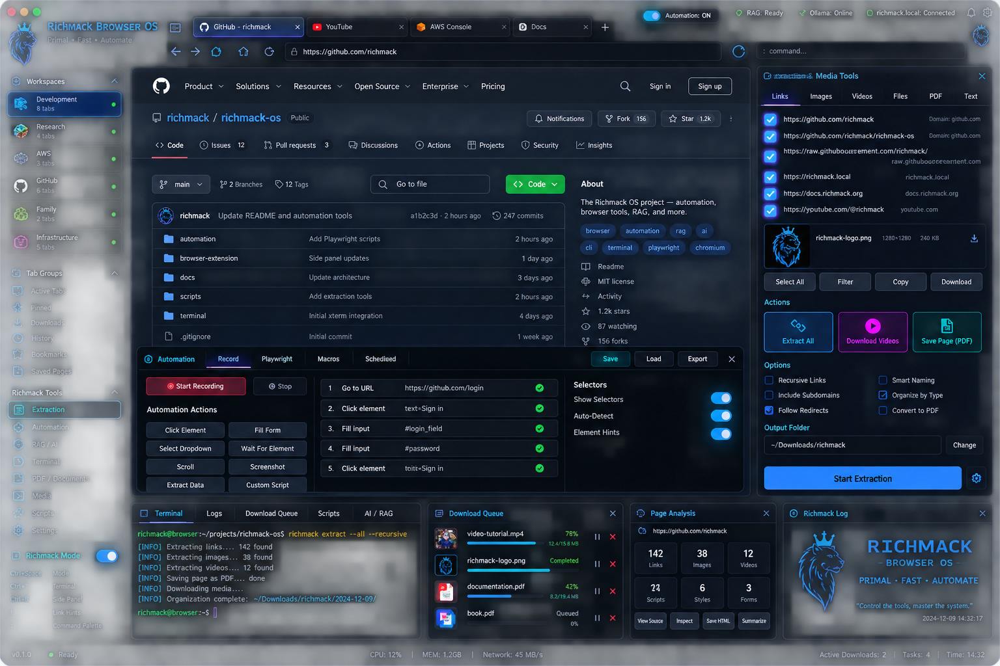

# Richmack Browser OS v0.1.0

A dark, keyboard-first Chromium layer centered on workspaces, smart bookmarks, extraction, local tools, and browser automation.



## What works in this starter

- Dedicated Richmack Chromium profile launcher
- Manifest V3 side panel
- Dark / compact Richmack interface and custom Richmack icon
- Workspace selector foundation
- Smart bookmarks with workspace, tags, unread state, visit counts, and filtering
- Active-tab browser manager
- Richmack keyboard mode with `j`, `k`, `g`, `G`, `f`, `Esc`
- Link hints overlay
- One-click page scan for links, images, direct videos, PDFs, downloadable files, and page text
- Copy extracted links
- Download discovered images and PDFs
- Save visible page text
- Video download handoff to a local `yt-dlp` service
- Selector testing and click automation
- Saved click-workflow foundation
- Safe terminal panel backed by an allowlisted local service
- PDF / EPUB / TXT / MD / CSV / JSON text extraction API
- Docker Compose service bound only to `127.0.0.1`

## Deliberate security defaults

Richmack Browser does **not** inject a persistent content script into every site. Page access is initiated by the user. Automation can request persistent access to an individual HTTP/S origin when needed.

The local service is published only on `127.0.0.1:8765`. The container drops Linux capabilities, uses `no-new-privileges`, runs as an unprivileged user, has a read-only root filesystem, and exposes only a dedicated downloads directory plus a read-only work directory.

The terminal API does not accept shell syntax or arbitrary commands. It maps exact command names to fixed argument arrays and invokes them with `shell=False`.

See [docs/SECURITY.md](docs/SECURITY.md).

## Quick start

### 1. Start the optional local service

```bash
mkdir -p "$HOME/Downloads/Richmack"
cd richmack-browser-v0.1.0
docker compose up -d --build
curl -s http://127.0.0.1:8765/health
```

### 2. Launch the dedicated Richmack browser profile

macOS/Linux:

```bash
./launcher/richmack-browser
```

Chrome/Chromium will start with the unpacked extension loaded from this repository and an isolated profile at:

```text
~/.richmack/browser-profile
```

You can also load `extension/` manually from `chrome://extensions` with Developer Mode enabled.

## Keyboard mode

Use the extension command configured as **Toggle Richmack keyboard mode**. The suggested shortcut is `Command+Shift+Space` on macOS or `Ctrl+Shift+Space` elsewhere.

Current keys:

| Key | Action |
|---|---|
| `j` | Scroll down |
| `k` | Scroll up |
| `g` | Top |
| `G` | Bottom |
| `f` | Show link/button hints |
| `Esc` | Clear hints |

The next milestone is a full command palette and multi-key hint activation.

## Extraction

Open the Richmack side panel and choose **Extract**. `Scan Current Page` enumerates:

- links
- images
- direct video sources
- PDF links
- EPUB/TXT/Markdown/CSV/JSON links
- visible page text

The video button passes the current page URL to `yt-dlp` inside the local container. Use it only for media you are authorized to download and where permitted by the service/site terms.

## Safe terminal

The v0.1 terminal intentionally supports only these fixed commands:

```text
pwd
ls
whoami
git status
git log
```

Add commands by editing `ALLOWED_COMMANDS` in `services/app/main.py`. Keep entries as fixed argv arrays rather than accepting arbitrary shell input.

## Files and books

The local service includes:

```text
POST /documents/analyze
```

It only reads files underneath the mounted Richmack download sandbox. Supported formats in v0.1:

```text
PDF EPUB TXT MD CSV JSON
```

## Architecture

```text
Chromium / Chrome
      |
      +-- Richmack MV3 extension
      |      +-- side panel
      |      +-- keyboard mode
      |      +-- smart bookmarks
      |      +-- extraction
      |      +-- automation
      |
      +---- localhost only ----> Richmack Services container
                                  +-- safe command allowlist
                                  +-- yt-dlp
                                  +-- PDF / EPUB / text parsing
                                  +-- future Playwright worker
```

## Next build targets

1. Real Zen-style tab-to-workspace assignment and workspace restoration.
2. Essentials / pinned tabs / workspace tab groups.
3. Smart folders and domain routing UI.
4. Command palette (`:`) and command registry.
5. Link-hint key activation instead of display-only hints.
6. Automation recorder for click/fill/select/wait/download steps.
7. Secret references instead of credentials in workflows.
8. Download queue and file-vault database.
9. Split-pane terminal using a Native Messaging host or tightly scoped local PTY broker.
10. Optional Playwright service profile.
11. Optional local RAG / Ollama integration.
12. Signed macOS/Linux installers.

## Important limitation

This is a **Chromium layer**, not a Chromium source fork. That is intentional: upstream Chromium/Chrome keeps responsibility for browser security patches, while Richmack owns the UI and automation layer.

## v0.2.0 performance / Chromium pass

- Chromium-only launcher on macOS/Linux; no silent Google Chrome fallback.
- Subtle geometric wolf icon using the existing Richmack blue/cyan/purple palette.
- Compact side-panel rail mode via the menu button. Chrome still controls the physical side-panel width; compact mode stops rendering the heavy panel content.
- Collapsible Workspace, Smart Bookmarks, Active Tabs, Downloads, Scan Output and Workflow sections.
- Active Tabs are loaded only when their section is expanded.
- Workflow UI is loaded only when Automation is opened.
- Backend health is checked only when Extract or Terminal is opened; there is no health polling loop.
- Tab refreshes are event-driven rather than timer-driven.
- Richmack mode gives brief page feedback and qutebrowser-style letter hints.
- Safe terminal remains local-service-only and command allowlisted.
- yt-dlp is pinned to the exact development build that pip advertised as available during the v0.1 install failure.

### macOS Chromium launch

```bash
./launcher/richmack-browser
```

The launcher searches `/Applications/Chromium.app/Contents/MacOS/Chromium` first and intentionally refuses to fall back to Google Chrome.
